At AWS re:Invent 2023, the EKS team introduced Pod Identity to simplify how Kubernetes workloads receive IAM credentials.

Applications in a pod can use the AWS SDK or AWS CLI to call AWS services with IAM permissions. EKS Pod Identity provides a simpler alternative to distributing credentials: you associate an IAM role with a Kubernetes service account, then configure pods to use that service account.

This guide configures an application running in Amazon EKS to access Amazon S3 through EKS Pod Identity.

## Step 0: Before you start
> 1. AWS account.
> 2. [EKSctl](https://eksctl.io/) used for communicating with the cluster API server.
> 3. AWS-IAM-Authenticator – with necessary permissions to call the EKS API.
> 4. EKS Cluster (v1.27) - If you don't know how to set up an EKS cluster, [click here](https://docs.aws.amazon.com/eks/latest/userguide/getting-started.html).

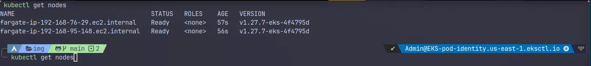

:::caution[Check current requirements]
The screenshots use Amazon EKS 1.27. Choose a version that is currently supported in your region, and review the latest [Amazon EKS pricing](https://aws.amazon.com/eks/pricing/) before creating a cluster.
:::

## Step 1: Install the EKS Pod Identity Agent Add-on and Create an IAM Role

Our first step is to set up a new IAM role with required permissions to access my S3 bucket.

```json title="IAM.Json" caption="The trust policy" showLineNumbers{1} 
{
    "Version": "2012-10-17",
    "Statement": [
        {
            "Effect": "Allow",
            "Principal": {
                "Service": "pods.eks.amazonaws.com"
            },
            "Action": [
                "sts:AssumeRole",
                "sts:TagSession"
            ]
        }
    ]
}
```
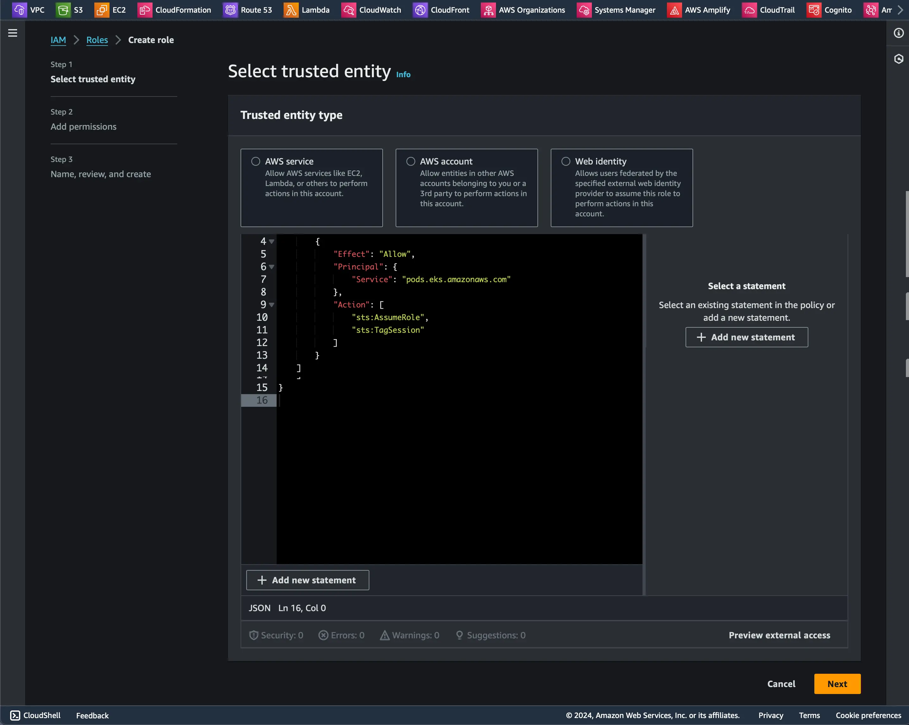
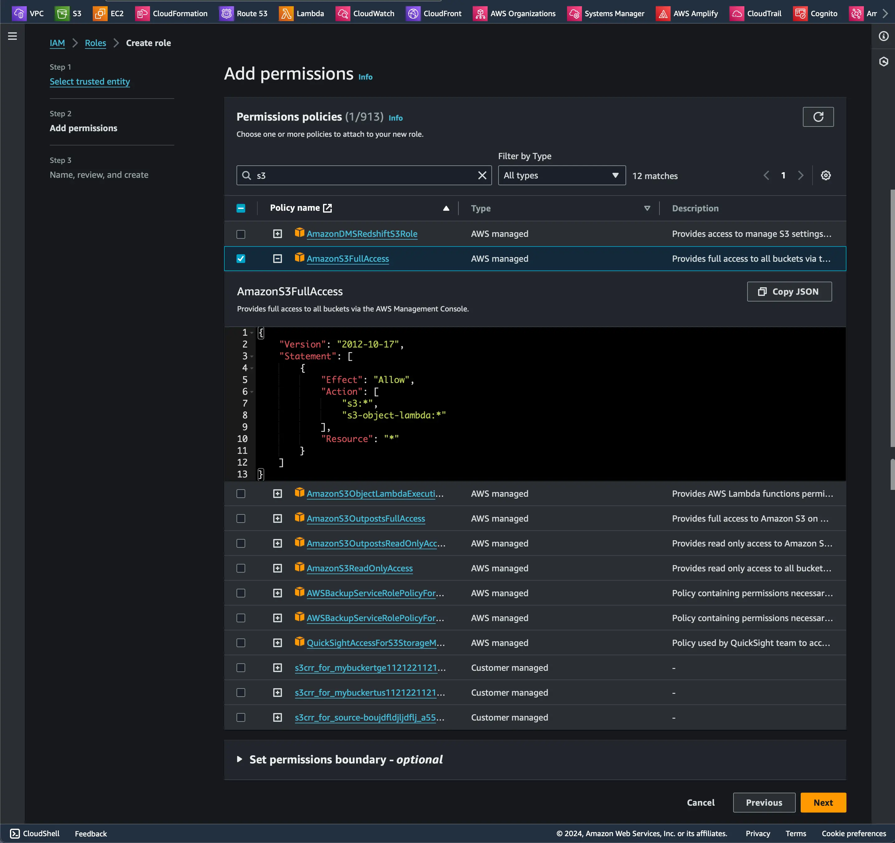
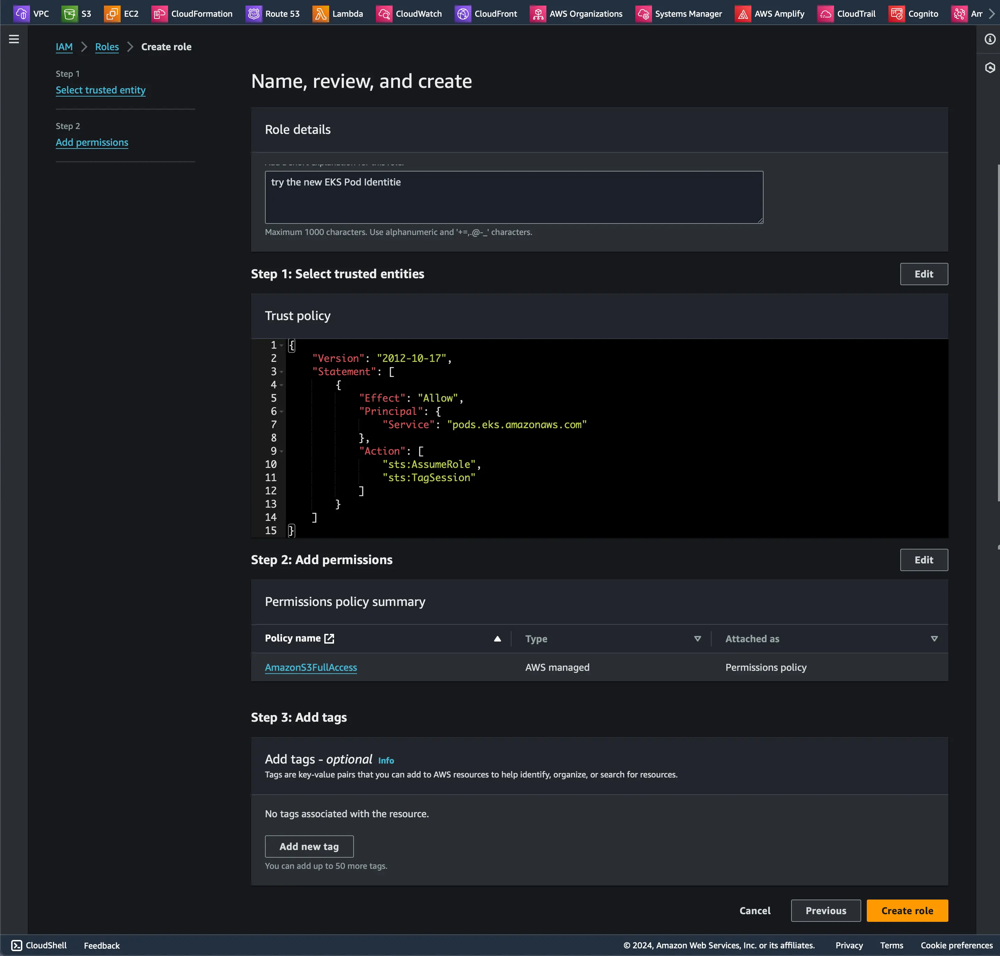

Then you need to install the EKS Pod Identity Agent add-on. You can do it via the console or eksctl. I will choose eksctl because it's easier and quicker. Don't forget to replace the name of the cluster and the region that you chose.

```bash title="Install the EKS Pod Identity Agent" 
eksctl create addon --cluster EKS-pod-identity --name eks-pod-identity-agent --region us-east-1
```

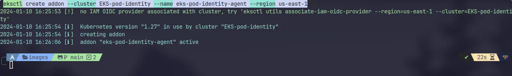

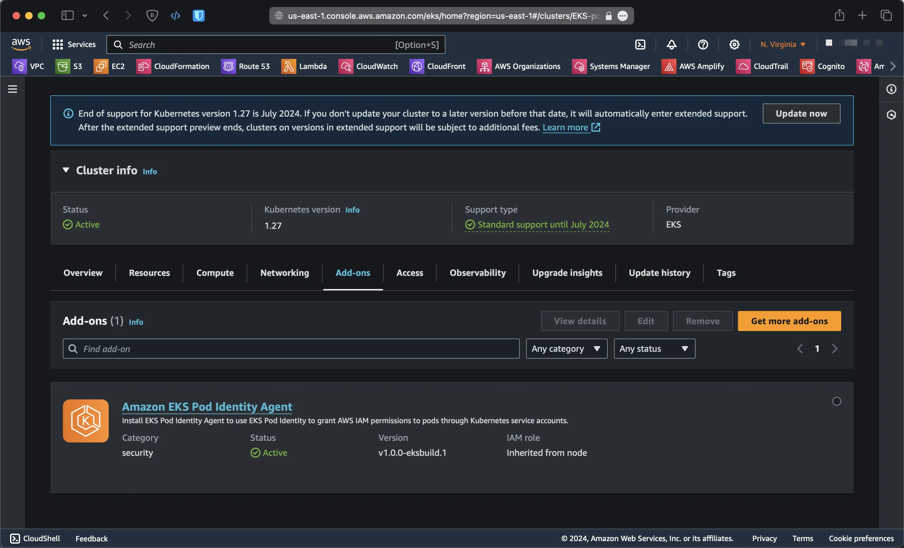

Now, navigate to the 'Access' tab in the EKS cluster, click on 'Pod Identity Associations' to map our IAM role to Kubernetes pods.
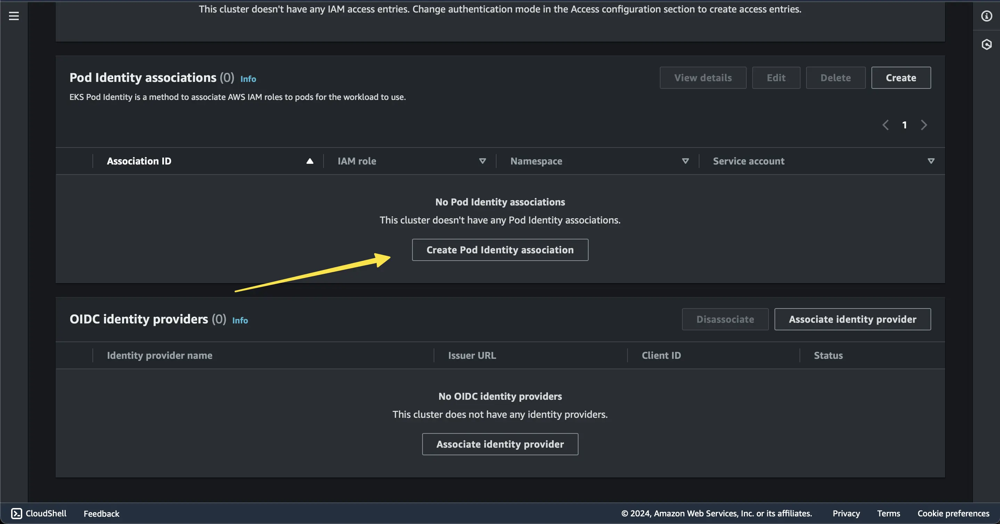

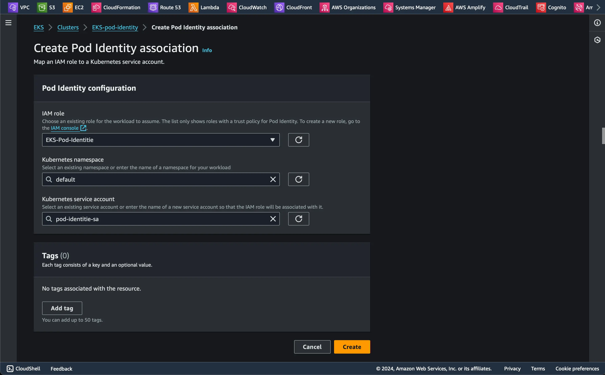

## Step 2: Create an S3 bucket and a service account to test the new Pod Identity

Create an S3 bucket for testing, again, you can do it via the console or AWS CLI

```bash title="Create an S3 bucket" 
aws s3api create-bucket --bucket fadyio-eks-pod-identity --region us-east-1
```
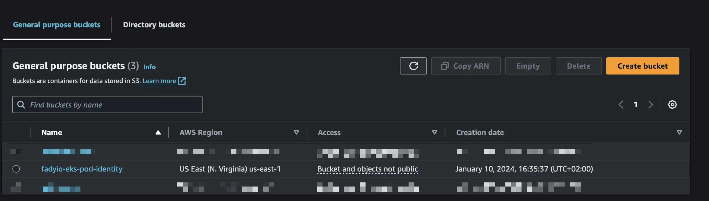

Then, create a service account with the IAM role that we previously created

```yml title="ServiceAccount.yml" caption="The service account config" showLineNumbers{1} 
apiVersion: v1
kind: ServiceAccount
metadata:
  annotations:
    eks.amazonaws.com/role-arn: arn:aws:iam::<YOUR-ACCOUNTID>:role/EKS-Pod-Identity
  name: pod-identity-sa
  namespace: default
```

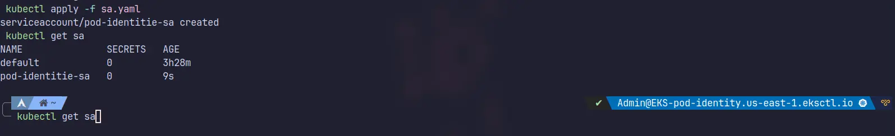

## Step 3: Create a Pod to test access to the S3 bucket

```yml title="Pod.yml" caption="The Pod manifest" showLineNumbers{1} 
apiVersion: v1
kind: Pod
metadata:
  name: ubuntu-identity
spec:
  serviceAccountName: pod-identity-sa
  containers:
  - command:
    - sleep
    - "3600"
    image: ubuntu
    name: ubuntu-identity
```

```bash title="Apply the Pod manifest"
kubectl apply -f FILENAME.yaml
```

we will go into the pod to install the AWS CLI and try to list S3 buckets

```bash title="Get into the pod"
kubectl exec -it ubuntu-identity -- /bin/bash
```

from the [AWS CLI Installation Guide](https://docs.aws.amazon.com/cli/latest/userguide/getting-started-install.html)


```bash  title="Install the AWS CLI"
apt update && apt install unzip curl -y
curl "https://awscli.amazonaws.com/awscli-exe-linux-x86_64.zip" -o "awscliv2.zip"
unzip awscliv2.zip
./aws/install
```
Let's try to copy the AWS CLI zip file to the S3 bucket

```bash title="Copy the AWS CLI zip file to the S3 bucket"
aws s3 cp awscliv2.zip s3://fadyio-eks-pod-identity/
```

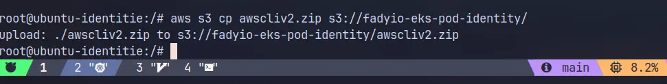
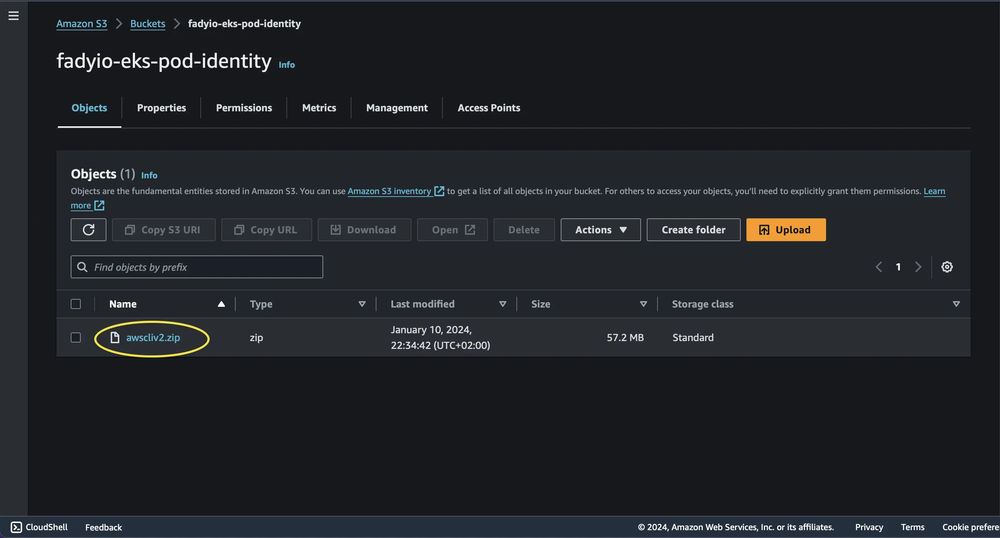

## Summing it up
EKS Pod Identity is a game-changer that simplifies IAM permissions for applications that runs on EKS, A hassle-free configuration experience that makes it easy to define the necessary IAM permissions for your applications in Amazon EKS, Plus, it brings a bunch of security perks like Least Privilege, Credential Isolation, Auditability, Reusability, and better Scalability into the mix.
