## The problem

CI/CD workflows often need access to private resources. Exposing those resources to the public internet is risky, while maintaining a traditional VPN can add unnecessary complexity.

Tailscale provides a simpler approach: it can connect a GitHub Actions runner to private AWS resources through an encrypted tailnet without requiring a publicly exposed VPN server.

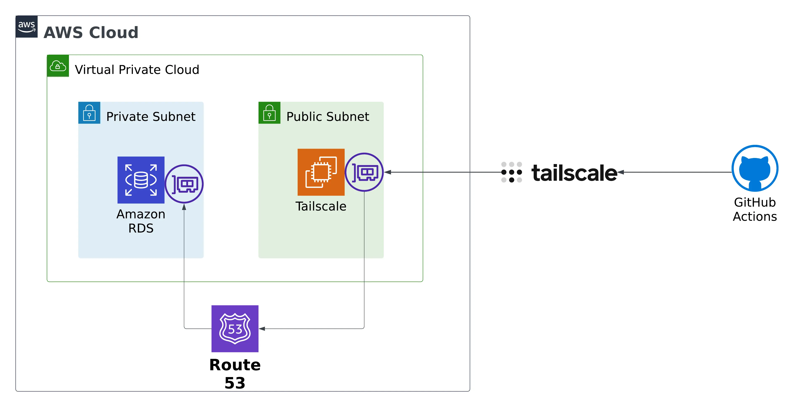

The architecture above is implemented in three stages: connect a GitHub Actions runner to the tailnet, configure an EC2 instance as a Tailscale subnet router, and allow only the required traffic to private AWS resources.

## Connecting GitHub Actions to the Tailscale Network

Before starting this guide, you'll need to have a Tailscale network set up and configured with at least one existing device, If you do not know how, follow this [guide](https://tailscale.com/kb/1017/install/) and of course you're going to need an AWS account as well.

Now the next thing that I'm going to do is go out to GitHub and create a new repository. You can find the code for the end result in this [repository](https://github.com/Fadyio/Accessing-Private-AWS-Resources).

You will then need to create an OAuth client to use with the GitHub Action via this [link](https://login.tailscale.com/admin/settings/oauth), copy the Client ID and Client Secret to a safe place for now.
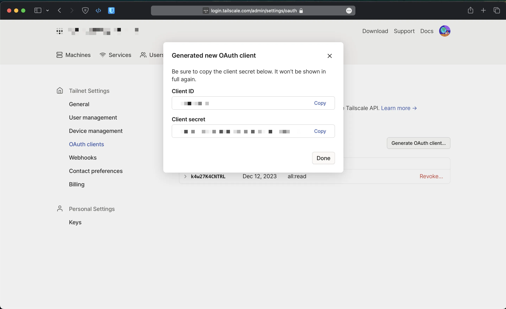

Go to the GitHub repo you created earlier and go to Settings > in the Security section of the sidebar, select Secrets and Variables, then click Actions, Create a GitHub secret with the name `TS_OAUTH_CLIENT_ID` and assign your OAuth client ID as the secret value and name `TS_OAUTH_SECRET` and assign your OAuth client secret as the secret value.

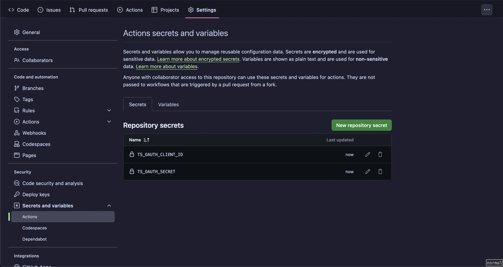

You will then need to create a server role account using ACL tags in Tailscale, basically ACL tags allow you to assign an identity to a device that is separate from human users, and use that identity as part of an ACL to restrict access. This should be used when adding servers to your Tailscale network, to learn more about ACL tags, [click here](https://tailscale.com/kb/1068/acl-tags/)

Open your favorite editor and create a .github directory and underneath .github we'll create a Workflows directory, this is the special directory that GitHub Actions is going to look for workflow files in, create a new workflow, I'm going to call it tailscale.yaml.

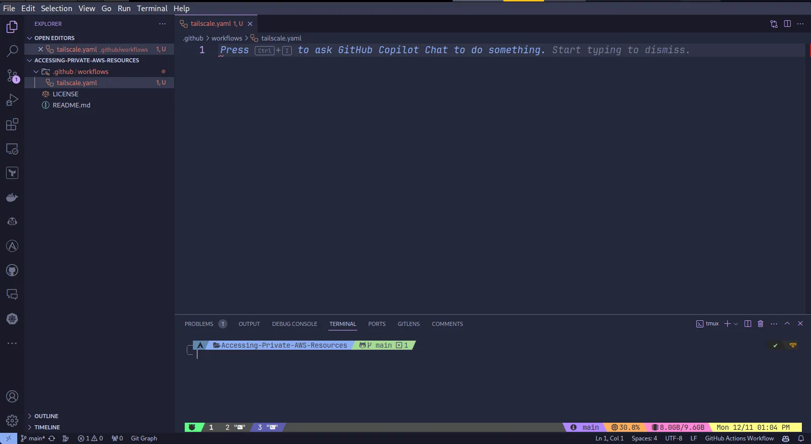

And inside of this file, we're going to go ahead and set up our basic workflow structure.

```yaml title="tailscaleAction.yaml" showLineNumbers{1}
on:
  workflow_dispatch:
  push:

jobs:
  deploy-via-tailscale:
    runs-on: ubuntu-latest
    steps:
    - uses: actions/checkout@v2
    - name: Tailscale
      uses: tailscale/github-action@v2
      with:
        oauth-client-id: ${{ secrets.TS_OAUTH_CLIENT_ID }}
        oauth-secret: ${{ secrets.TS_OAUTH_SECRET }}
        tags: tag:ci

```
Let me break it down for you. 

- the workflow dispatch event. Allows us to trigger workflows manually, which is great for debugging.
- The push event means that whenever we push a change, it goes ahead and triggers a build.
- Define the job and name it deploy-via-tailscale. It will run on the latest release of Ubuntu.
- connect to your tailnet by using the [Tailscale GitHub Action](https://github.com/tailscale/github-action)

Go ahead and push the code to GitHub, you should see an ephemeral node. The node can access nodes in your Tailnet, subject to the access rules that apply to the specified ACL tag(s).

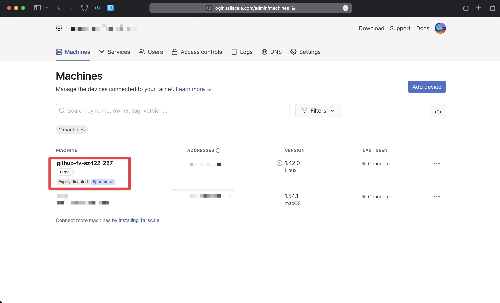

## Set Up Amazon VPC and Tailscale Router

What we're going to do is we're going to create a VPC, and then we're going to have this public subnet, and we're going to put an EC2 instance on that public subnet, and we're going to have that EC2 instance connect out to our Tailscale network as well, and then we're going to set that EC2 instance up as a router.

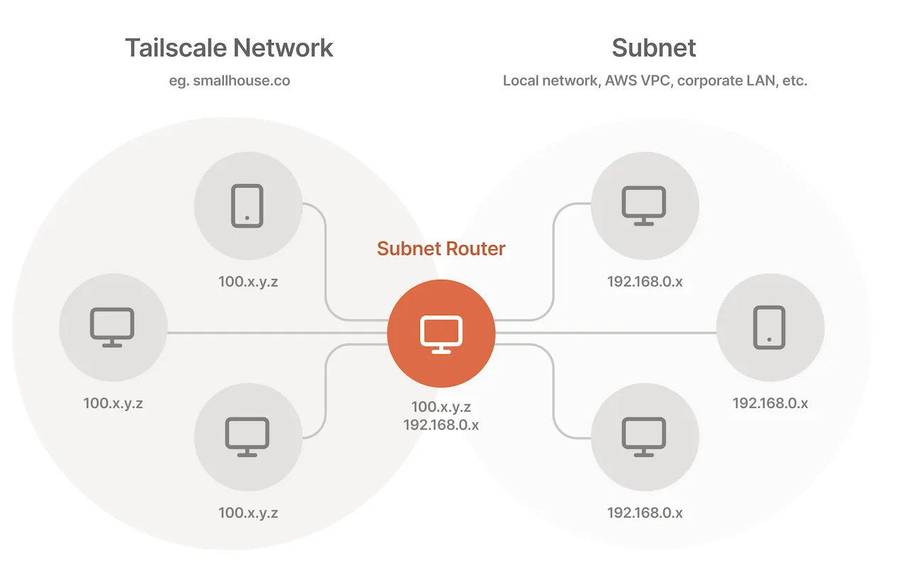

Let's go to the AWS Management Console. First, we'll create an elastic IP and EC2 instance on the public subnet, which will act as a subnet router.

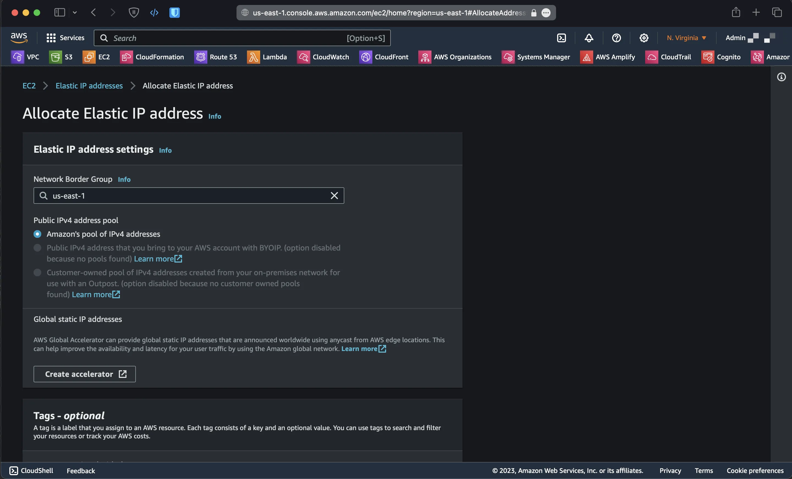

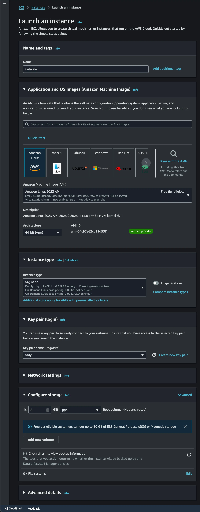

After the instance has passed the checks we need to download and install Tailscale onto your subnet router machine.
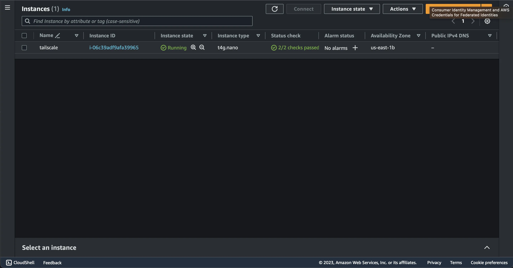

### Step 1: Install the Tailscale Client

SSH into the instance and follow the instructions.

```bash title="Install Tailscale"
curl -fsSL https://tailscale.com/install.sh | sh
```
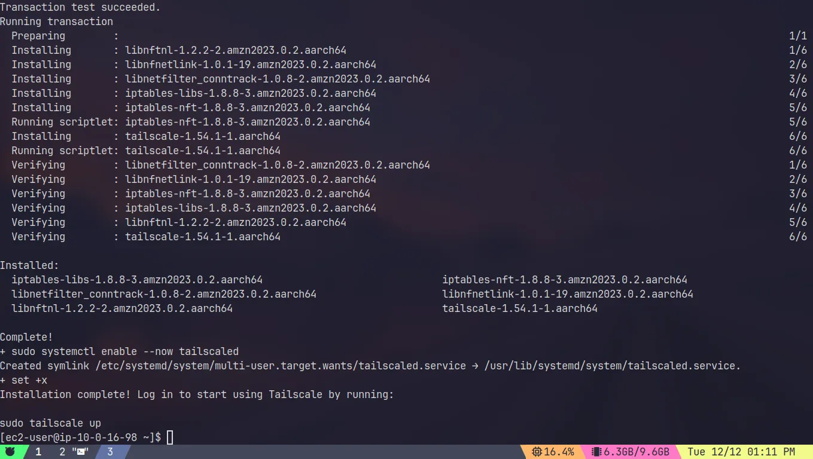

### Step 2: Enable IP Forwarding and Advertise Subnet Routes

```bash title="Enable IP forwarding"
echo 'net.ipv4.ip_forward = 1' | sudo tee -a /etc/sysctl.d/99-tailscale.conf
echo 'net.ipv6.conf.all.forwarding = 1' | sudo tee -a /etc/sysctl.d/99-tailscale.conf
sudo sysctl -p /etc/sysctl.d/99-tailscale.conf
```

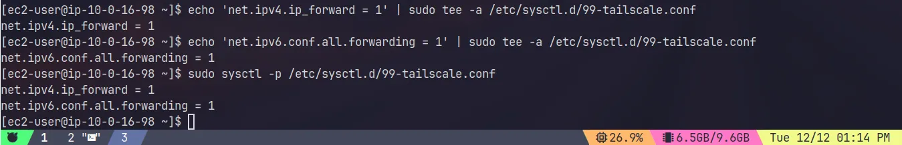

```bash title="Advertise subnet routes"
sudo tailscale up --advertise-routes=10.0.16.0/20 --accept-dns=false
```
Replace the subnets in the example above with the correct ones for your network. It will give you a link that you will need to go to in order to authenticate.
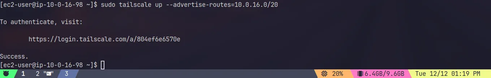

The EC2 instance should appear in the Tailscale Console.

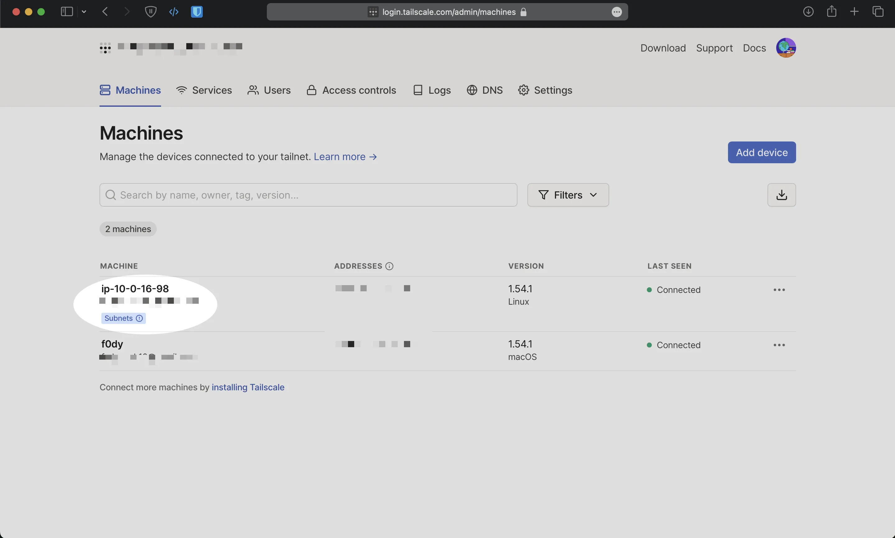

### Step 3: Enable Subnet Routes from the Tailscale Console

Locate the device that advertised subnet routes, from the ellipsis menu at the bottom of the table, select Edit Route Settings. This opens the Edit Route Settings panel.

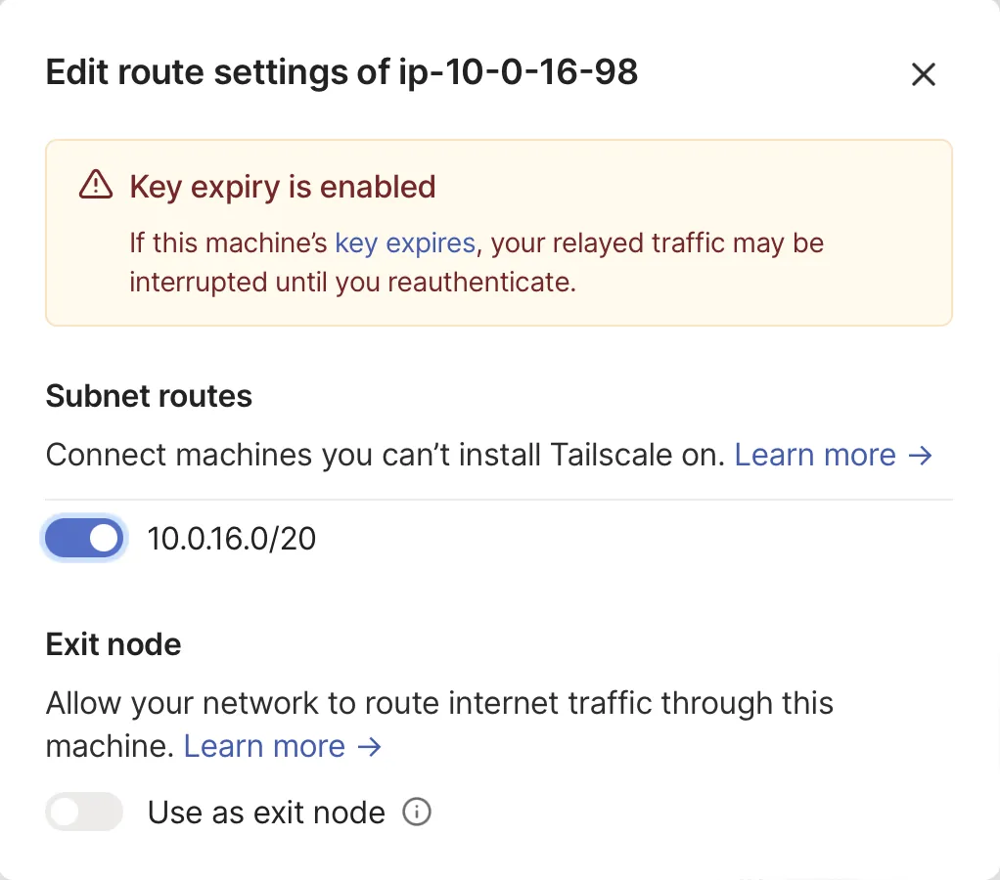

Everything should be working. To test connectivity, we will add a connectivity test to the GitHub Actions workflow, commit, and push the code.

```yaml title="tailscaleAction.yaml" showLineNumbers{1}
on:
  workflow_dispatch:
  push:

jobs:
  deploy-via-tailscale:
    runs-on: ubuntu-latest
    steps:
    - uses: actions/checkout@v2
    - name: Tailscale
      uses: tailscale/github-action@v2
      with:
        oauth-client-id: ${{ secrets.TS_OAUTH_CLIENT_ID }}
        oauth-secret: ${{ secrets.TS_OAUTH_SECRET }}
        tags: tag:ci
    - name: test-connectivity
      run: |
        ping -c 10 100.73.32.96
```
Replace the IP address with the IP address of the subnet router.

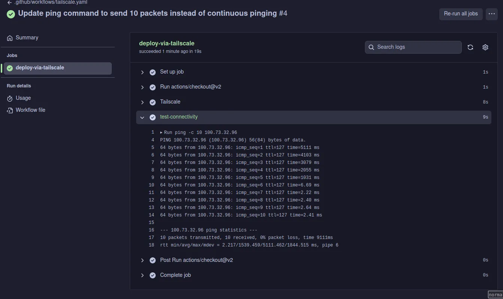

## Create Private Amazon RDS Instance and Test Connectivity

After reviewing and verifying, we will provision an Amazon RDS instance in our VPC and test connectivity from our GitHub Actions workflow.

First, we will create a security group that will allow connection from the subnet router, I'm going to call it the database security group.

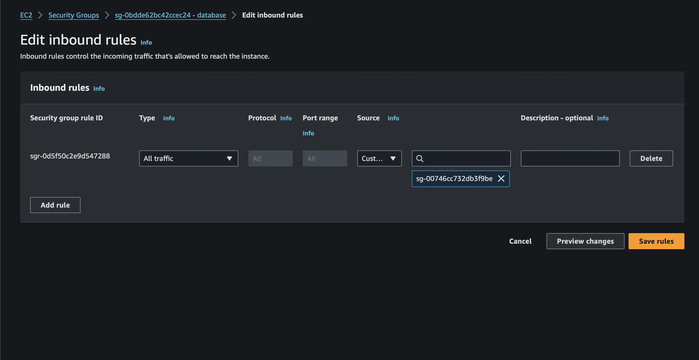

:::note
In a production environment, it is bad practice to allow all connections from a security group, Only allow access from trusted sources for specific ports and protocols, following the principle of least privilege.
:::

I will not cover how to create an RDS database here. I assume you have already created an RDS database, please refer to the [AWS documentation](https://docs.aws.amazon.com/AmazonRDS/latest/UserGuide/USER_CreateDBInstance.html) if you don't know how to create one.

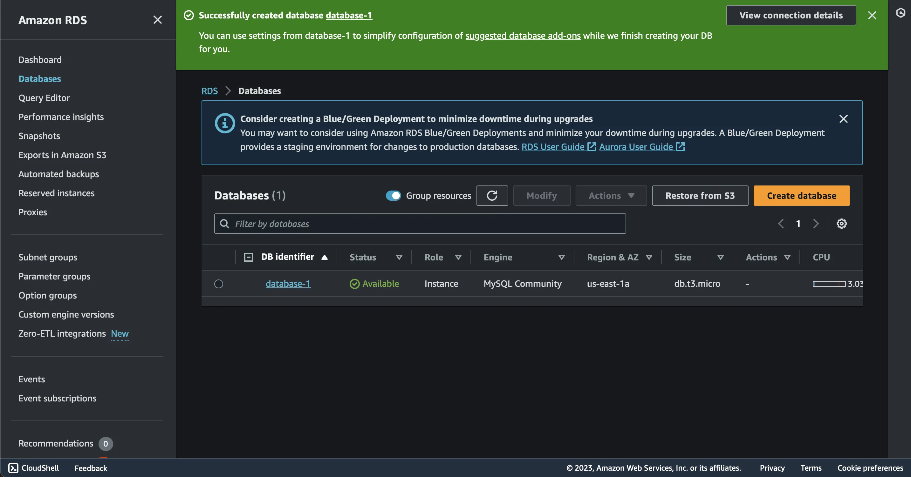

If you want to test connectivity between your machine and the private Amazon RDS instance type the following command. This action allows you to connect to the MySQL DB instance using the MySQL client, Replace endpoint with the DB instance endpoint (DNS name) and replace admin with the master username you used. Enter the master password that you used when prompted for a password.

```bash title="Test Connectivity"
mysql -h endpoint -P 3306 -u admin -p
```
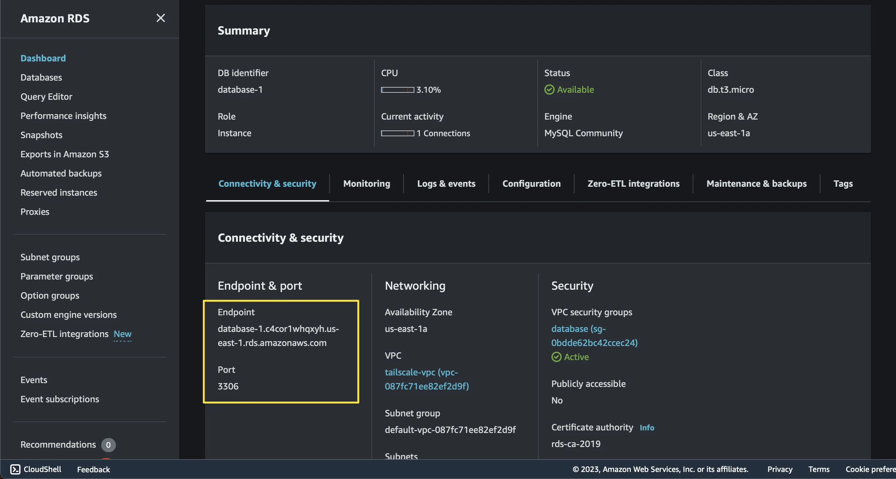

If everything is configured correctly, you should be able to see this message.
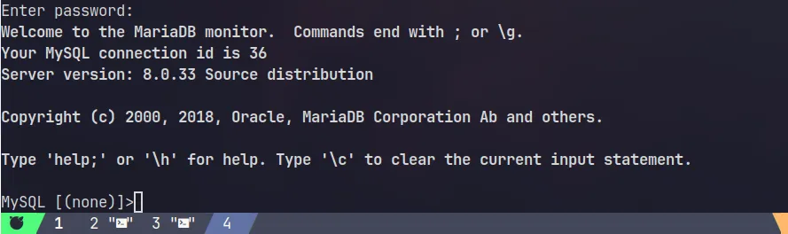

We will return to the GitHub Actions workflow to test connectivity, we will create three secrets for the database endpoint, password, and username.

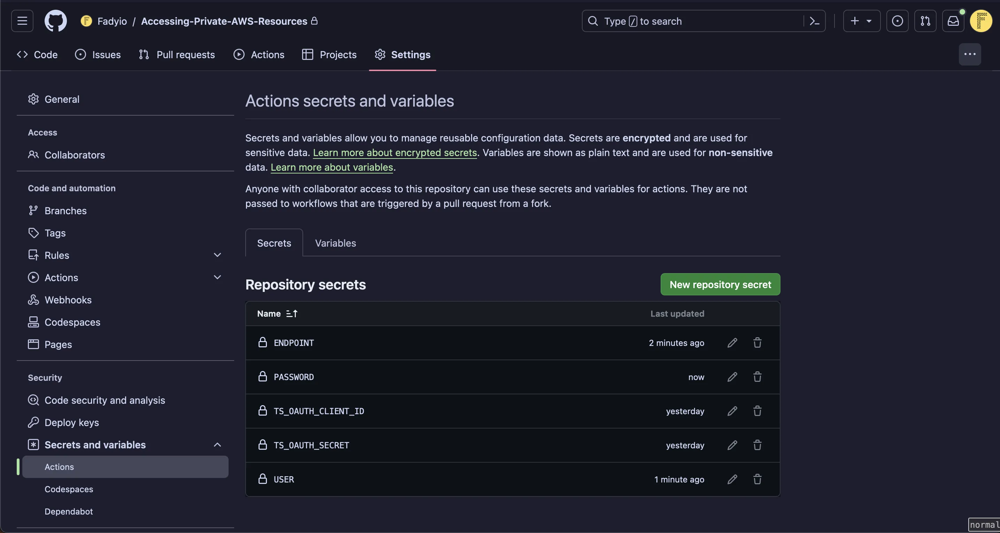

Update the workflow with this to test connectivity. We can now connect to RDS from any node in the Tailnet, using the same DNS name used inside AWS.


```yaml title="tailscaleAction.yaml" showLineNumbers{1}
on:
  workflow_dispatch:
  push:

jobs:
  deploy-via-tailscale:
    runs-on: ubuntu-latest
    steps:
    - uses: actions/checkout@v2
    - name: Tailscale
      uses: tailscale/github-action@v2
      with:
        oauth-client-id: ${{ secrets.TS_OAUTH_CLIENT_ID }}
        oauth-secret: ${{ secrets.TS_OAUTH_SECRET }}
        tags: tag:ci
    - name: Test-Connectivity-to-AWS-RDS
      run: |
        mysql -h ${{ secrets.ENDPOINT }} -u ${{ secrets.USER }} -p"${{ secrets.PASSWORD }}" -e "show databases;"
```
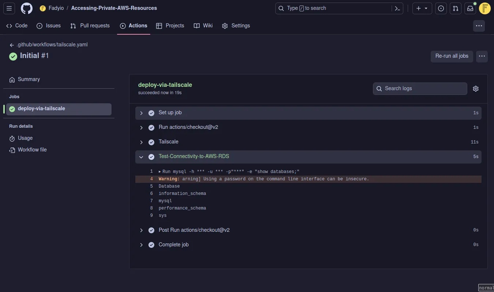

## Conclusion

In this blog, we've demonstrated how to create a secure and seamless connection between GitHub Actions workflows and private AWS resources. This approach not only improves the overall security of your CI/CD pipeline, but also ensures that sensitive data and interactions remain within your network, Tailscale is easy to use, and has robust encryption mechanisms.

:::note
This is not sponsored or endorsed by Tailscale, I use the Tailscale at work and in my home lab, I am just a happy customer.
One more thing, you can host [Tailscale Control Server](https://github.com/juanfont/headscale) yourself if you want, which is a plus.
:::